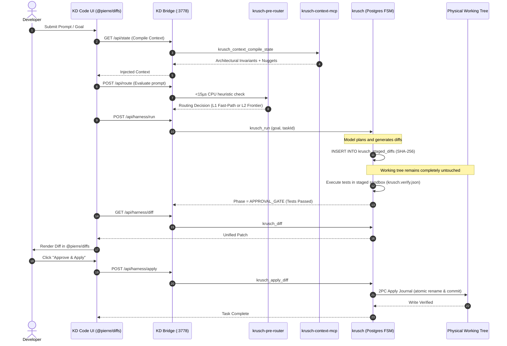

# Architecture: KD Code & The KruschDev Ecosystem

## 1. System Overview

**KD Code** is the visual control plane and human-in-the-loop workbench for the KruschDev coding ecosystem. It provides the developer experience: thread navigation, prompt composition, provider switching, and pre-commit diff review.

Rather than running heavy execution loops or in-process RAG in the client, KD Code delegates execution to **`krusch`** and memory to **`krusch-context-mcp`**:

```text
┌─────────────────────────────────────────────────────────────┐
│                    KD Code (krusch-ide)                     │
│               Stateless Visual Control Plane                │
│                                                             │
│   • React 19 Thin Client (apps/web)                         │
│   • Electron Desktop Shell (apps/desktop)                   │
│   • Pre-Commit Diff Inspector (@pierre/diffs)               │
│   • Typed Contracts & RPC (packages/contracts)              │
└──────────────────────────────┬──────────────────────────────┘
                               │
                               │ HTTP / MCP (:3778)
                               ▼
┌─────────────────────────────────────────────────────────────┐
│                  KD Bridge Daemon (:3778)                   │
│                  (scripts/context-cli.js)                   │
│                                                             │
│   • /api/state: Compiles architectural state from Postgres  │
│   • /api/route: Evaluates <15µs CPU pre-router + L2 centroid│
│   • /api/memory: Persists turn lessons & activity           │
│   • /api/nudge: Persists holographic steering nuggets       │
│   • /api/harness/*: Dispatches & inspects krusch tasks      │
└──────────────┬───────────────────────────────┬──────────────┘
               │                               │
               ▼                               ▼
┌───────────────────────────────┐ ┌───────────────────────────┐
│        krusch (Harness)       │ │     krusch-context-mcp    │
│  PostgreSQL ACID Staging FSM  │ │    Pinned v1.6.3 Memory   │
│                               │ │                           │
│ • krusch_tasks & turns        │ │ • Hybrid RRF Code Search  │
│ • krusch_staged_diffs (SHA)   │ │ • AST Symbol Graph        │
│ • Sandboxed test verification │ │ • Episodic Memory         │
│ • 2PC Apply Journal to disk   │ │ • Dynamic vector dim guard│
│ • File leases & crash recovery│ │ • Holographic Nuggets     │
└──────────────┬────────────────┘ └───────────────────────────┘
               │
               ▼
┌───────────────────────────────┐
│       Routing Substrate       │
│ • krusch-pre-router (<15µs)   │
│ • krusch-cascade-router (L2)  │
│ • Claude / Gemini / Ollama    │
└───────────────────────────────┘
```

---

## 2. The Single Golden Path (Execution & Staging Cycle)

The system enforces an absolute invariant: **models never write directly to the working tree.** All proposed changes flow through PostgreSQL staging and automated test verification before physical disk mutation:



---

## 3. Separation of Responsibilities

### KD Code (`krusch-ide`)
- **Visual Command Deck**: Renders prompt input, session history, active terminals, and diff cards.
- **Model Switching**: Allows selecting between Gemini 3.1, Claude 3.7, and local Ollama models without state loss.
- **Diff Inspection**: Native syntax-highlighted diff rendering via `@pierre/diffs`.

### krusch (`../krusch`)
- **Postgres FSM**: Authoritative task lifecycle (`PLAN -> IMPLEMENT -> VERIFY -> APPROVAL_GATE -> COMMITTED`).
- **Sandboxed Verification**: Applies staged diffs to a virtual staging directory and executes verification contracts (`krusch.verify.json`).
- **Two-Phase Commit (2PC) Apply Journal**: Staged diffs are applied via temporary file write, `fsync`, and atomic rename. Preimage snapshots ensure instant crash recovery.

### krusch-context-mcp (`../krusch-context-mcp`)
- **Semantic Memory**: Reciprocal Rank Fusion (RRF) combining dense vector embeddings with exact AST symbol extraction.
- **Centroid Routing**: Neural classification of prompts into functional archetypes.
- **Steering Nuggets**: Negative constraints and behavioral guidance automatically injected into prompts.

---

## 4. Technical Constraints

- **Language & Runtime**: TypeScript, Node.js 22+, Bun, Effect-TS
- **Database**: PostgreSQL 16 with `pgvector` (dimension default: 1024 / nomic-embed-text)
- **UI Stack**: React 19, Tailwind / Vanilla CSS, `@pierre/diffs`
- **Desktop**: Electron 40 with typed IPC bridges
