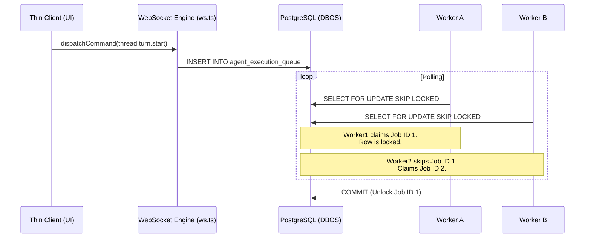
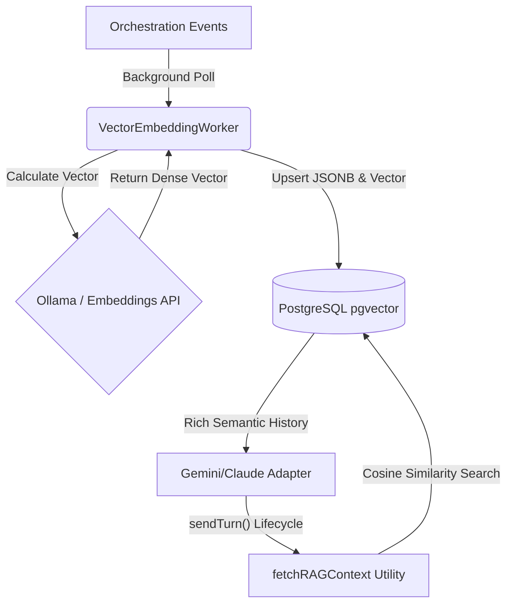

# Architecture: Krusch DBOS

## 1. What Is This?

Krusch DBOS is a highly-concurrent agentic UI retrofitted with a Database-Oriented Operating System (DBOS) architecture. By swapping local, file-bound storage for a stateless client-server PostgreSQL model, the IDE becomes horizontally scalable. This allows multiple instances to execute code, plan orchestrations, and read files concurrently without lock contention, treating the Postgres database as the central orchestration queue.

## 2. Core Concepts

### DBOS `SKIP LOCKED` Queues

To achieve true stateless concurrency, in-memory orchestration loops are transitioned to Postgres-native job queues. Workers poll for pending jobs using `SELECT ... FOR UPDATE SKIP LOCKED`. This ensures that even if multiple worker containers are running on different compute nodes, a single agentic task is consumed exactly once without deadlocks.

### Unified PostgreSQL Persistence Architecture

The persistence layer relies entirely on a stateless, unified database engine, resolving UI hydration bottlenecks and preserving strict project isolation without local file constraints:

- **Global PostgreSQL Orchestrator**: Implemented via `@effect/sql-pg`. Handles massive, stateless JSONB queuing, global metadata, multi-node job dispatch, and vector embeddings. By fully migrating away from SQLite, the DBOS engine avoids `SQLITE_BUSY` contention and enables true horizontal scaling.

### Multi-Node Scalability

The architecture completely decouples the heavy Node.js execution environments from the UI, distributing the workload across specialized nodes:

- **Database Node:** Hosts the PostgreSQL database with the `pgvector` extension.
- **Compute Node(s):** Runs the stateless Krusch DBOS server and local workers natively or via Docker.
- **Thin Client:** The React-based web UI or Electron Desktop app connects to the remote DBOS backend over standard HTTP/WS, allowing zero-friction usage from low-power laptops.

### Universal RAG & Vector Embeddings

To maintain semantic awareness across sessions, all AI Provider Adapters (`GeminiAdapter`, `ClaudeAdapter`, `OpenCodeAdapter`, etc.) utilize a universal `fetchRAGContext` pipeline.

- The `VectorEmbeddingWorker` asynchronously calculates `pgvector` embeddings for all orchestration events.
- **Native Project Isolation:** The `VectorEmbeddingWorker` traces events back to their source project ID during embedding. When an AI provider fetches context, DBOS strictly filters the Postgres vector search by the active project, enforcing hard multi-tenant isolation and preventing context bleed.
- During any provider execution hook (e.g., `sendTurn`), adapters inject relevant context from the Postgres vector store, ensuring context is retrieved independently of the local file system.

## 3. Data Model

The core relational data model revolves around:

- **OrchestrationEvent**: Represents every atomic agent action, thought, tool call, and lifecycle hook.
- **ProjectionThread**: Represents a materialized view of the IDE's current state (files read, stdout captured, active errors).

## 4. Technical Constraints

- **Stack**: Node.js, Effect-TS, Vite/React
- **Database**: PostgreSQL (with `pgvector` extension)
- **Build / Tooling**: Bun (used for dependency management and execution)

## 5. Deployment

The backend can be easily containerized and distributed via `docker-compose`.

- Ensure `DATABASE_URL` is injected into the container environment.
  The application utilizes an automatic environment discovery system, preventing the strict requirement of static `.env` files in dynamic deployments.
